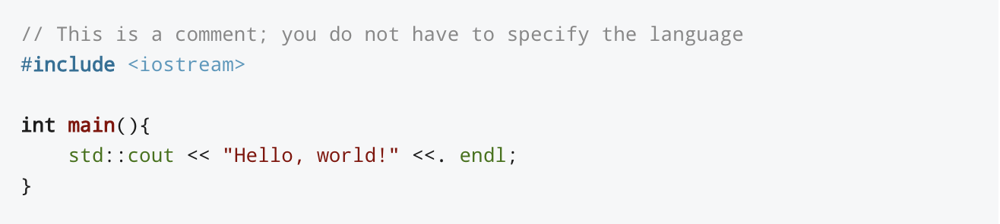

# reddit-code-highlight

Tired of reading code on Reddit in plain text?

Adapted from a random Reddit page: https://www.reddit.com/r/redesign/comments/blsxsu/add_syntax_highlighting_to_reddit_markdown_code/

## About

A Google Chrome extension (Sorry Safari) to highlight code found on reddit.com, using [highlight.js](https://highlightjs.org/). Change highlighter style in the options page via `chrome://extensions/`.

## Installation

- Download this repository from GitHub at https://github.com/theboi/reddit-code-highlight.
- Via the command line, navigate to the repository you just downloaded (using `cd`).
- Run `npm i; npx webpack`.
- Go to `chrome://extensions/`.
- Toggle `Developer mode` on (top right corner).
- Click `Load Unpacked` and locate the the repository you just downloaded.
- Why? Because I am too broke to pay Google for a Chrome Web Store developer account (sorry :sweat::sob:).

## Customisation

- At `chrome://extensions/`, under this extension, click `Details` > `Extension options`.

## Motivation

I began using Reddit the other day and wanted to help a fellow Redditor solve his issue with code. However, he posted a huge chunk of plain text code which was slightly frustrating. Upon scouring the web, I figured out that code highlighting did not exist on Reddit natively. I also wanted to learn how I could use webpack and create web extensions. Thus, reddit-code-highlighter was born.

## Development Resources

If you are wondering how to use npm modules (or even any modules for that matter) in Chrome Extensions:
- Using modules in Chrome extensions content script: https://stackoverflow.com/questions/48104433/how-to-import-es6-modules-in-content-script-for-chrome-extension/48121629#48121629

## License

This open sourced repository is licensed under the GNU General Public License v3.0.
